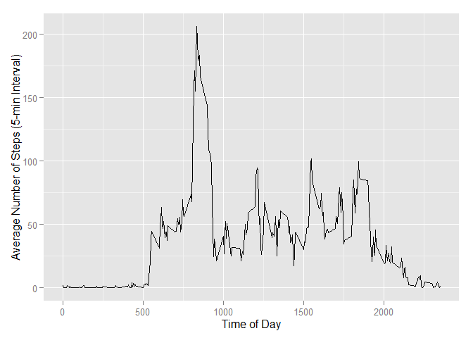

# Reproducible Research: Peer Assessment 1


## Loading and preprocessing the data

Data File "activity.zip" resides in the same folder. Convert "date" column to POSIXlt format for easier graph plotting.


```r
activityData <- read.csv(unz("activity.zip", "activity.csv"), colClasses = c("integer", "Date", "integer"))
```


## What is mean total number of steps taken per day?


```r
stepsByDay <- aggregate(steps ~ date, activityData, sum)
```


```r
library(ggplot2)
h <- ggplot(stepsByDay, aes(x = steps)) + geom_histogram(binwidth = 2500, aes(fill = ..count..))
h + labs(x = "Daily Total Steps", y = "Number of Days", fill = "Number of Days")
```

 


```r
with(stepsByDay, data.frame(Mean = mean(steps), Median = median(steps), row.names = "Daily Total Steps"))
```

```
##                       Mean Median
## Daily Total Steps 10766.19  10765
```


## What is the average daily activity pattern?


```r
meanStepsByInterval <- aggregate(steps ~ interval, activityData, mean)
p <- qplot(interval, steps, data=meanStepsByInterval, geom = "line")
p + labs(x = "Interval Number", y = "Average Number of Steps")
```

 


```r
with(meanStepsByInterval, interval[which.max(steps)])
```

```
## [1] 835
```

## Imputing missing values


```r
sum(is.na(activityData$steps))
```

```
## [1] 2304
```


```r
names(meanStepsByInterval)[2] <- "meanSteps"
imputedData <- merge(activityData, meanStepsByInterval)
imputedData$steps[is.na(imputedData$steps)] <- imputedData$meanSteps[is.na(imputedData$steps)]
```


```r
stepsByDayImputed <- aggregate(steps ~ date, imputedData, sum)
h2 <- ggplot(stepsByDayImputed, aes(x = steps)) + geom_histogram(binwidth = 2500, aes(fill = ..count..))
h2 + labs(x = "Daily Total Steps", y = "Number of Days", fill = "Number of Days")
```

 


```r
rbind(with(stepsByDay, data.frame(Mean = mean(steps), Median = median(steps),
                                  row.names = "Daily Total Steps (Original)")),
      with(stepsByDayImputed, data.frame(Mean = mean(steps), Median = median(steps), 
                                         row.names = "Daily Total Steps (Imputed)")))
```

```
##                                  Mean   Median
## Daily Total Steps (Original) 10766.19 10765.00
## Daily Total Steps (Imputed)  10766.19 10766.19
```


## Are there differences in activity patterns between weekdays and weekends?


```r
imputedData$dayType <- factor(ifelse(weekdays(imputedData$date) %in% c("Saturday", "Sunday"), 
                                     "Weekend", "Weekday"))
meanByDayIntvl <- aggregate(steps ~ interval + dayType, imputedData, mean)
p2 <- qplot(interval, steps, data=meanByDayIntvl, geom = "line", facets = dayType ~ .)
p2 + labs(x = "Interval Number", y = "Average Number of Steps")
```

 

